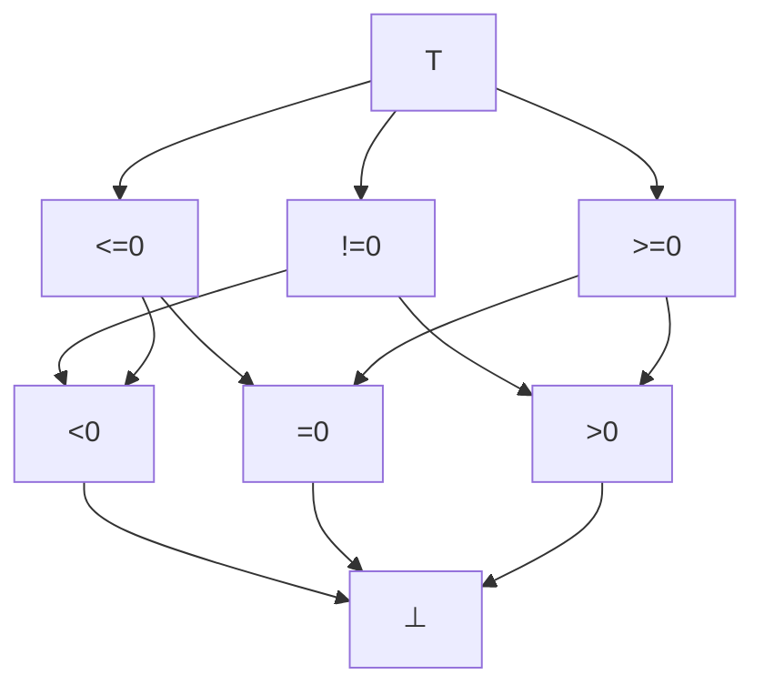

# Sign Analysis

This analysis implements the following Hasse Diagram

```mermaid
  graph TD;
    T --> negZero[<=0];
    T --> nonZero[!=0];
    T -->posZero[>=0];

    nonZero --> neg[<0];
    nonZero --> pos[>0];

    negZero --> eqZero[=0];
    negZero --> neg;

    posZero --> eqZero;
    posZero --> pos;

    neg --> Bottom[⊥];
    eqZero --> Bottom;
    pos --> Bottom;
```
